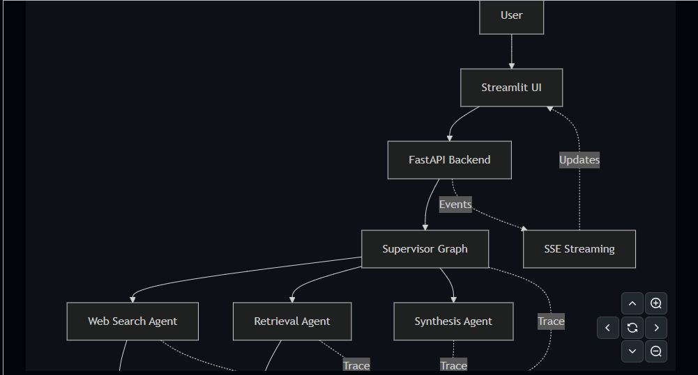

# Supervisor Agent System

## Overview

A production-oriented multi-agent AI system built using FastAPI, LangGraph, Redis, Tavily Search, Docker, AWS ECR, and EC2.

The system demonstrates agent orchestration, state persistence, observability, load testing, and cloud deployment.

---

## Architecture




### System Flow

User Request
→ FastAPI API Layer
→ Supervisor Agent (LangGraph)
→ Web Search Agent (Tavily)
→ Retrieval Agent (ChromaDB)
→ Synthesis Agent
→ Final Response

### Infrastructure

* FastAPI backend
* LangGraph orchestration
* Redis state management
* ChromaDB vector storage
* Tavily web search
* LangSmith observability
* Docker containerization
* AWS ECR image registry
* AWS EC2 deployment


---

## Features

* Multi-agent workflow orchestration using LangGraph
* Supervisor, Web Search, Retrieval, and Synthesis agents
* Redis-based state management
* Tavily-powered web search
* FastAPI backend
* Dockerized deployment
* AWS ECR container registry
* AWS EC2 deployment
* LangSmith tracing
* A/B prompt experimentation
* Load testing using Locust

---

## Tech Stack

* Python
* FastAPI
* LangGraph
* Redis
* Tavily API
* Docker
* AWS EC2
* AWS ECR
* LangSmith
* Locust

---

## Setup

## Setup Guide

### Clone Repository

```bash
git clone <repository-url>
cd supervisor-agent-system
```

### Create Virtual Environment

```bash
cd backend

python -m venv .venv

# Windows
.venv\Scripts\activate

# Linux/Mac
source .venv/bin/activate
```

### Install Dependencies

```bash
pip install -r requirements.txt
```

### Configure Environment Variables

Create `.env`:

```env
TAVILY_API_KEY=your_key
LANGCHAIN_API_KEY=your_key
LANGCHAIN_TRACING_V2=true
LANGCHAIN_PROJECT=supervisor-agent-system
AB_TEST_VARIANT=v1
```

### Start Redis

```bash
docker run -d \
--name redis-agent-state \
-p 6379:6379 \
redis:latest
```

### Run Application

```bash
uvicorn app.main:app --reload
```

Application:

```text
http://127.0.0.1:8000
```

Swagger:

```text
http://127.0.0.1:8000/docs
```

### Run Load Tests

```bash
locust -f locustfile.py \
--host=http://127.0.0.1:8000
```

Locust Dashboard:

```text
http://localhost:8089
```

### Docker Build

```bash
docker build -t supervisor-agent-system .
```

### AWS Deployment

```bash
Docker
→ AWS ECR
→ AWS EC2
```


---

## API Endpoints


### Health Check

```http
GET /
```

Response:

```json
{
  "message": "Supervisor Agent System Running"
}
```

---

### Stream Workflow

```http
GET /stream
```

Executes the multi-agent workflow:

1. Supervisor planning
2. Web search execution
3. Retrieval processing
4. Synthesis generation
5. Final response streaming

Response Type:

```text
text/event-stream
```

---

### Interactive Documentation

```text
http://127.0.0.1:8000/docs
```


---

## Load Testing

## Metrics & Load Testing

### Observability

The system includes:

* LangSmith tracing
* Prompt version tracking
* A/B prompt experimentation
* Redis-backed workflow state persistence
* FastAPI request logging

### Load Test Configuration

* Tool: Locust
* Concurrent Users: 5
* Ramp-up Rate: 1 user/sec
* Endpoint Tested: `/stream`

### Results

| Metric                | Value    |
| --------------------- | -------- |
| Requests per Second   | ~2.2     |
| Average Response Time | ~911 ms  |
| Median Response Time  | ~690 ms  |
| 95th Percentile       | ~2400 ms |
| 99th Percentile       | ~3400 ms |
| Maximum Response Time | ~4315 ms |

### Bottleneck Analysis

The primary bottleneck identified during testing was the external Tavily Search API.

Concurrent workflow execution triggered multiple outbound search requests, eventually resulting in:

```text
UsageLimitExceededError
```

This demonstrated the importance of:

* Request rate limiting
* Response caching
* Retry policies
* Dependency protection strategies

### Future Improvements
## Future Improvements

* Semantic caching using vector similarity
* ChromaDB document retrieval integration
* Multi-provider search fallback
* Cost-aware routing
* Agent memory persistence
* Multi-tenant support
* Rate limiting
* Audit logging
* Cost caps per user
* Kubernetes deployment
* CI/CD automation
* Production monitoring dashboards


---

## Deployment

## Deployment

### Containerization

The application is packaged using Docker.

```text
FastAPI
↓
Docker Image
↓
AWS ECR
↓
AWS EC2
```

### Cloud Infrastructure

* AWS ECR for container registry
* AWS EC2 for application hosting
* Docker runtime environment
* Redis state management
* Tavily external search service

### Deployment Workflow

Developer Push
→ GitHub
→ Docker Build
→ ECR Push
→ EC2 Pull
→ Docker Run


---

## Demo Video

[Demo Video Link Placeholder]
