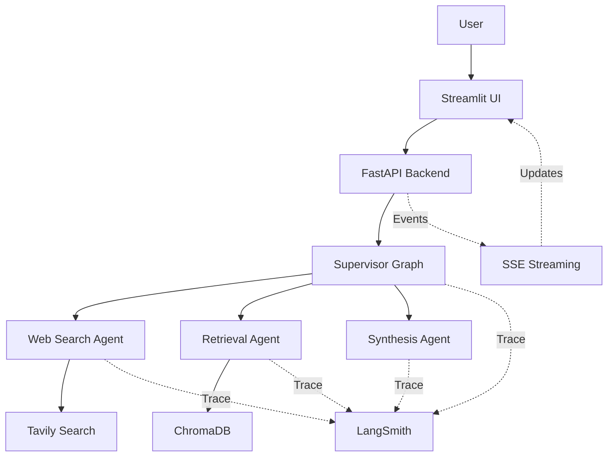

# Supervisor Agent System Architecture

```mermaid
flowchart TD

    U[User]

    UI[Streamlit UI]

    API[FastAPI Backend]

    SG[Supervisor Graph]

    WS[Web Search Agent]

    RA[Retrieval Agent]

    SA[Synthesis Agent]

    TV[Tavily Search]

    DB[ChromaDB]

    LS[LangSmith]

    SSE[SSE Streaming]


    U --> UI

    UI --> API

    API --> SG

    SG --> WS

    SG --> RA

    SG --> SA

    WS --> TV

    RA --> DB

    WS -.Trace.-> LS

    RA -.Trace.-> LS

    SA -.Trace.-> LS

    SG -.Trace.-> LS

    API -.Events.-> SSE

    SSE -.Updates.-> UI
```